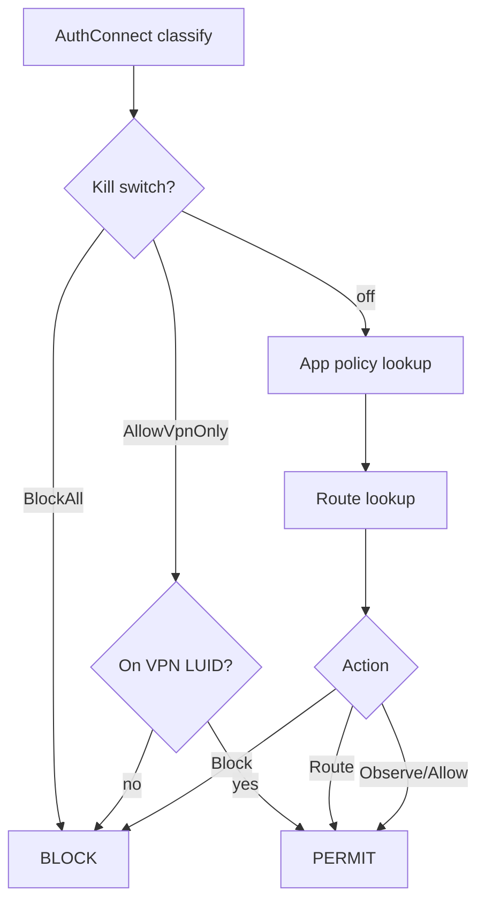

# WFP Callouts

## Registered callouts

| GUID suffix | Layer | Handler |
|-------------|-------|---------|
| AuthConnectV4 | `FWPM_LAYER_ALE_AUTH_CONNECT_V4` | `GuardianAuthConnectClassifyV4` |
| AuthConnectV6 | `FWPM_LAYER_ALE_AUTH_CONNECT_V6` | `GuardianAuthConnectClassifyV6` |
| FlowEstablishedV4 | `FWPM_LAYER_ALE_FLOW_ESTABLISHED_V4` | `GuardianFlowEstablishedClassify` |
| FlowEstablishedV6 | `FWPM_LAYER_ALE_FLOW_ESTABLISHED_V6` | `GuardianFlowEstablishedClassify` |
| DnsDatagramV4/V6 | `FWPM_LAYER_DATAGRAM_DATA_*` | observe-only (Phase 8-I) |

GUIDs are defined in `shared/ids/guardian_guids.h`.

## Classify flow

## Action matrix

| Policy action | WFP result |
|---------------|------------|
| Allow | PERMIT |
| Block | BLOCK + ABSORB |
| Route | PERMIT (interface bind via route table) |
| Observe | PERMIT + telemetry |

## Userspace filter registration

Core opens an FWPM session and adds filters referencing Guardian callout GUIDs. Kernel registers callouts via `FwpsCalloutRegister1`; userspace adds filters via `FwpmCalloutAdd0` + `FwpmFilterAdd0`.

## Telemetry

Each classify records action type and sampled latency via `KernelTelemetryRecordClassify`.
